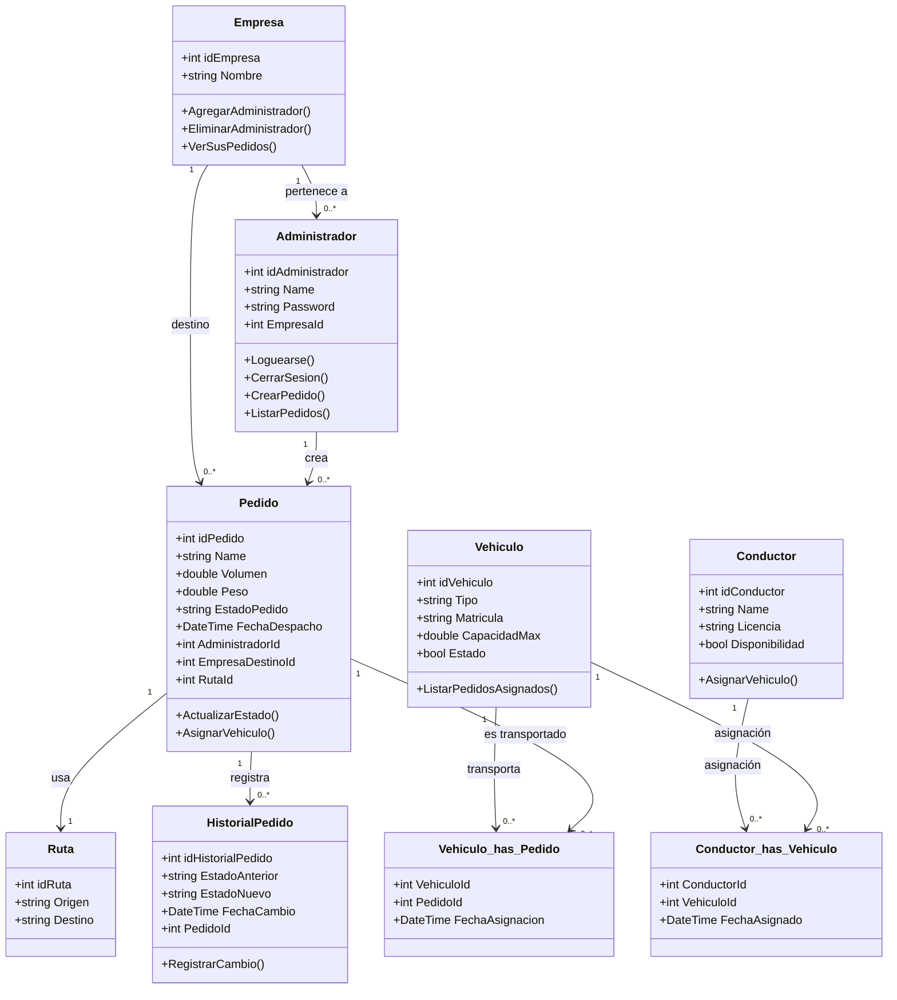

### Diagrama de clases

```mermaid
classDiagram

    class Empresa {
        +int idEmpresa
        +string Nombre
        +AgregarAdministrador()
        +EliminarAdministrador()
        +VerSusPedidos()
    }

    class Administrador {
        +int idAdministrador
        +string Name
        +string Password
        +int EmpresaId
        +Loguearse()
        +CerrarSesion()
        +CrearPedido()
        +ListarPedidos()
    }

    class Pedido {
        +int idPedido
        +string Name
        +double Volumen
        +double Peso
        +string EstadoPedido
        +DateTime FechaDespacho
        +int AdministradorId
        +int EmpresaDestinoId
        +int RutaId
        +ActualizarEstado()
        +AsignarVehiculo()
    }

    class Ruta {
        +int idRuta
        +string Origen
        +string Destino
    }

    class Conductor {
        +int idConductor
        +string Name
        +string Licencia
        +bool Disponibilidad
        +AsignarVehiculo()
    }

    class Vehiculo {
        +int idVehiculo
        +string Tipo
        +string Matricula
        +double CapacidadMax
        +bool Estado
        +ListarPedidosAsignados()
    }

    class HistorialPedido {
        +int idHistorialPedido
        +string EstadoAnterior
        +string EstadoNuevo
        +DateTime FechaCambio
        +int PedidoId
        +RegistrarCambio()
    }

    class Conductor_has_Vehiculo {
        +int ConductorId
        +int VehiculoId
        +DateTime FechaAsignado
    }

    class Vehiculo_has_Pedido {
        +int VehiculoId
        +int PedidoId
        +DateTime FechaAsignacion
    }

    %% Relaciones

    Empresa "1" --> "0..*" Administrador : pertenece a
    Empresa "1" --> "0..*" Pedido : destino
    Administrador "1" --> "0..*" Pedido : crea
    Pedido "1" --> "1" Ruta : usa
    Pedido "1" --> "0..*" HistorialPedido : registra
    Conductor "1" --> "0..*" Conductor_has_Vehiculo : asignación
    Vehiculo "1" --> "0..*" Conductor_has_Vehiculo : asignación
    Vehiculo "1" --> "0..*" Vehiculo_has_Pedido : transporta
    Pedido "1" --> "0..*" Vehiculo_has_Pedido : es transportado
```