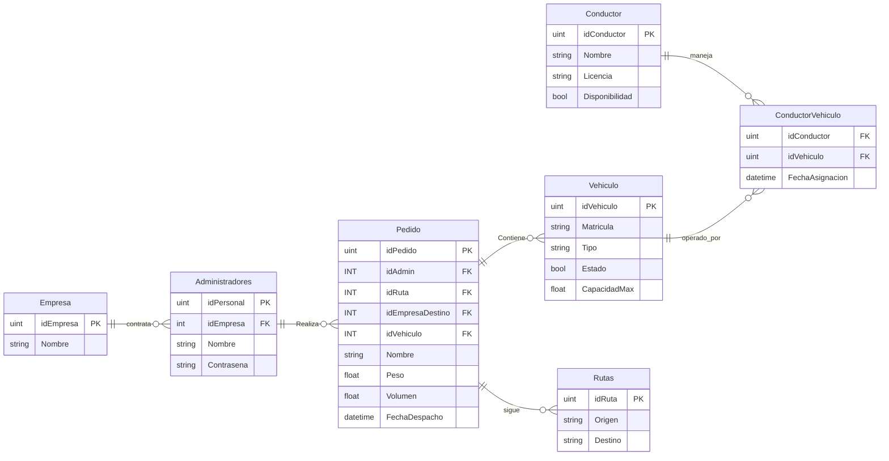

### Diagrama de Base de datos

```mermaid
erDiagram
direction LR
    Pedido {
        uint      idPedido        PK
        INT       idAdmin   FK
        INT       idRuta    FK  
        INT       idEmpresaDestino  FK
        INT       idVehiculo    FK
        string    Nombre
        float     Peso
        float     Volumen
        datetime  FechaDespacho
    }

    Empresa {
        uint     idEmpresa     PK
        string   Nombre
    }

    Vehiculo {
        uint     idVehiculo     PK
        string   Matricula
        string   Tipo
        bool     Estado
        float    CapacidadMax
    }

    Conductor {
        uint     idConductor    PK
        string   Nombre
        string   Licencia
        bool     Disponibilidad
    }

    ConductorVehiculo {
        uint     idConductor    FK
        uint     idVehiculo     FK
        datetime FechaAsignacion
    }

    Rutas {
        uint     idRuta         PK
        string   Origen
        string   Destino
    }

    Administradores {
        uint     idPersonal     PK
        int      idEmpresa      FK 
        string   Nombre
        string   Contrasena
    }

    %% Relaciones
    Empresa ||--o{ Administradores : contrata
    Conductor ||--o{ ConductorVehiculo : maneja
    Vehiculo ||--o{ ConductorVehiculo : operado_por
    Pedido ||--o{ Rutas : sigue
    Administradores ||--o{ Pedido : Realiza
    Pedido ||--o{ Vehiculo : Contiene
```
