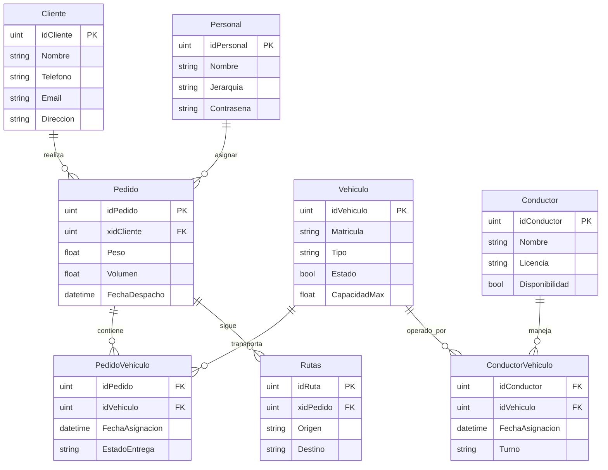

### Diagrama de Base de Datos

```mermaid
erDiagram

    Pedido {
        uint      idPedido        PK
        uint      xidCliente      FK
        float     Peso
        float     Volumen
        datetime  FechaDespacho
    }

    Cliente {
        uint     idCliente     PK
        string   Nombre
        string   Telefono
        string   Email
        string   Direccion
    }

    Vehiculo {
        uint     idVehiculo     PK
        string   Matricula
        string   Tipo
        bool     Estado
        float    CapacidadMax
    }

    Conductor {
        uint     idConductor    PK
        string   Nombre
        string   Licencia
        bool     Disponibilidad
    }

    PedidoVehiculo {
        uint     idPedido       FK
        uint     idVehiculo     FK
        datetime FechaAsignacion
        string   EstadoEntrega
    }

    ConductorVehiculo {
        uint     idConductor    FK
        uint     idVehiculo     FK
        datetime FechaAsignacion
        string   Turno
    }

    Rutas {
        uint     idRuta         PK
        uint     xidPedido      FK
        string   Origen
        string   Destino
    }

    Personal {
        uint     idPersonal     PK
        string   Nombre
        string   Jerarquia
        string   Contrasena
    }

    %% Relaciones
    Cliente ||--o{ Pedido : realiza
    Pedido ||--o{ PedidoVehiculo : contiene
    Vehiculo ||--o{ PedidoVehiculo : transporta
    Conductor ||--o{ ConductorVehiculo : maneja
    Vehiculo ||--o{ ConductorVehiculo : operado_por
    Pedido ||--o{ Rutas : sigue
    Personal ||--o{ Pedido : asignar
```